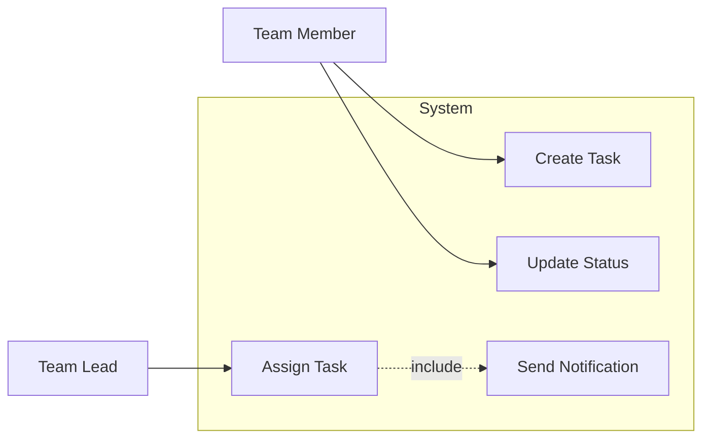
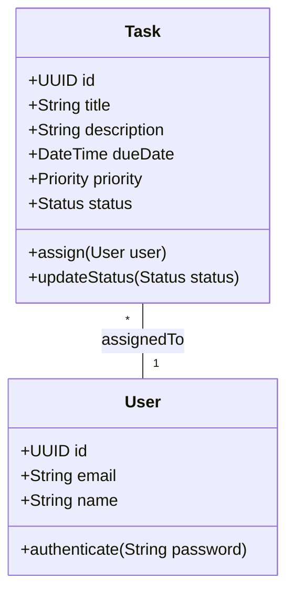
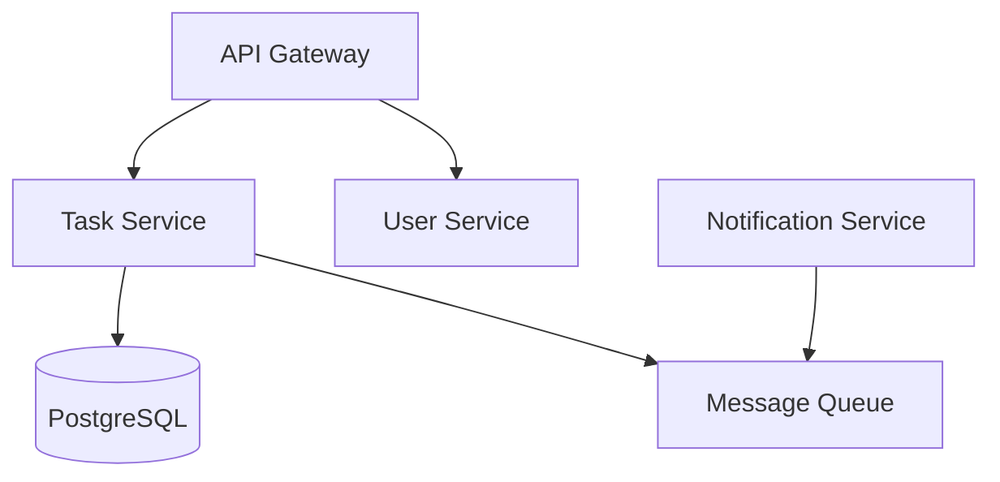

# Requirements Stage - Detailed Documentation

## Table of Contents

1. [Overview](#overview)
2. [Architecture](#architecture)
3. [Input Specification](#input-specification)
4. [Output Specification](#output-specification)
5. [Agent Design](#agent-design)
6. [Mermaid Diagram Generation](#mermaid-diagram-generation)
7. [Pipeline Integration](#pipeline-integration)
8. [DESMET Evaluation Integration](#desmet-evaluation-integration)
9. [Extending the Stage](#extending-the-stage)
10. [API Reference](#api-reference)

---

## Overview

The Requirements Stage is the **first stage** of the DESMET Agentic Platforms software engineering pipeline. Its purpose is to transform natural language requirements into structured, actionable artifacts that downstream stages (Code Generation, Testing, Build & Deploy) can consume.

### Goals

1. **Extract Structure from Natural Language** - Convert informal requirements into formal specifications
2. **Generate Design Artifacts** - Produce user stories, use cases, entity designs, and API specifications
3. **Create Visual Documentation** - Generate Mermaid diagrams for system documentation
4. **Enable Traceability** - Link requirements to design elements for verification
5. **Feed Downstream Stages** - Produce structured JSON outputs for code generation and testing

### Key Features

| Feature | Description |
|---------|-------------|
| Multi-format Input | Accepts natural language, user stories, or structured requirements |
| Comprehensive Output | Produces 8+ artifact types from a single input |
| Mermaid Diagrams | Generates 7 diagram types automatically |
| Platform Agnostic | Abstract interface for implementing on any agentic platform |
| Pipeline Ready | Exports structured JSON for downstream stage consumption |

---

## Architecture

### Component Diagram

```
┌─────────────────────────────────────────────────────────────────┐
│                     Requirements Stage                          │
├─────────────────────────────────────────────────────────────────┤
│                                                                 │
│  ┌──────────────┐    ┌──────────────────┐    ┌──────────────┐  │
│  │    Input     │───►│  Requirements    │───►│    Output    │  │
│  │   Schema     │    │     Agent        │    │    Schema    │  │
│  └──────────────┘    └────────┬─────────┘    └──────────────┘  │
│                               │                                 │
│                               ▼                                 │
│                      ┌──────────────────┐                       │
│                      │    Mermaid       │                       │
│                      │   Templates      │                       │
│                      └──────────────────┘                       │
│                                                                 │
│  ┌──────────────────────────────────────────────────────────┐  │
│  │                    Stage Runner                           │  │
│  │  - Orchestrates agent execution                          │  │
│  │  - Exports outputs to files                              │  │
│  │  - Generates pipeline artifacts                          │  │
│  └──────────────────────────────────────────────────────────┘  │
│                                                                 │
└─────────────────────────────────────────────────────────────────┘
```

### File Structure

```
requirements/
├── __init__.py                 # Module exports and public API
├── README.md                   # Quick start guide
├── DOCUMENTATION.md            # This file - detailed documentation
├── stage_runner.py             # Stage orchestration and file export
│
├── schemas/                    # Data structures
│   ├── __init__.py
│   ├── input_schema.py         # RequirementsInput and related types
│   └── output_schema.py        # RequirementsOutput and all artifact types
│
├── agents/                     # Agent implementations
│   ├── __init__.py
│   └── requirements_agent.py   # Base agent and simple implementation
│
├── templates/                  # Mermaid generators
│   ├── __init__.py
│   └── mermaid_templates.py    # All diagram type generators
│
├── examples/                   # Usage examples
│   ├── example_usage.py        # Code examples
│   └── sample_requirements.txt # Sample input file
│
└── outputs/                    # Generated outputs (runtime)
    └── {project_name}/
        ├── diagrams/           # Mermaid .mermaid files
        ├── requirements_output.json
        ├── user_stories.md
        ├── requirements_specification.md
        ├── for_code_generation.json
        └── for_testing.json
```

---

## Input Specification

### RequirementsInput Class

The primary input structure for the Requirements Stage.

```python
@dataclass
class RequirementsInput:
    project_name: str                    # Required: Project identifier
    project_description: str             # Required: High-level description
    raw_requirements: str                # Required: Natural language requirements
    requirement_type: RequirementType    # Optional: Input format type
    domain: ProjectDomain                # Optional: Application domain
    stakeholders: list[StakeholderInfo]  # Optional: Stakeholder details
    constraints: ConstraintInfo          # Optional: Project constraints
    existing_context: str                # Optional: Additional documentation
    target_technologies: list[str]       # Optional: Technology preferences
    quality_attributes: dict[str, int]   # Optional: NFR priorities
```

### Requirement Types

```python
class RequirementType(Enum):
    NATURAL_LANGUAGE = "natural_language"  # Free-form text
    USER_STORY = "user_story"              # As a..., I want..., So that...
    FEATURE_REQUEST = "feature_request"     # Feature descriptions
    STRUCTURED = "structured"               # Pre-structured format
```

### Project Domains

```python
class ProjectDomain(Enum):
    WEB_APPLICATION = "web_application"
    MOBILE_APP = "mobile_app"
    API_SERVICE = "api_service"
    CLI_TOOL = "cli_tool"
    DATA_PIPELINE = "data_pipeline"
    DESKTOP_APP = "desktop_app"
    EMBEDDED_SYSTEM = "embedded_system"
    OTHER = "other"
```

### Stakeholder Information

```python
@dataclass
class StakeholderInfo:
    name: str              # Stakeholder name/role
    role: str              # Their function
    concerns: list[str]    # Key concerns/priorities
    priority: int          # 1 = highest priority
```

### Constraints

```python
@dataclass
class ConstraintInfo:
    technical: list[str]   # Technical limitations
    business: list[str]    # Business constraints
    regulatory: list[str]  # Compliance requirements
    timeline: str          # Optional deadline
    budget: str            # Optional budget info
```

### Example Input

```python
input_data = RequirementsInput(
    project_name="TaskFlow",
    project_description="A modern task management application for teams",
    raw_requirements="""
    Users should be able to create, edit, and delete tasks.
    Tasks should have titles, descriptions, due dates, and priority levels.
    Users can assign tasks to team members.
    The system should send notifications for approaching deadlines.
    """,
    requirement_type=RequirementType.NATURAL_LANGUAGE,
    domain=ProjectDomain.WEB_APPLICATION,
    stakeholders=[
        StakeholderInfo(
            name="Team Lead",
            role="Manager",
            concerns=["Progress tracking", "Team visibility"],
            priority=1
        ),
        StakeholderInfo(
            name="Developer",
            role="User",
            concerns=["Easy task updates", "Clear priorities"],
            priority=1
        )
    ],
    constraints=ConstraintInfo(
        technical=["Must integrate with Slack", "PostgreSQL database"],
        business=["Support 100 concurrent users"],
        regulatory=["GDPR compliant for EU users"]
    ),
    target_technologies=["Python", "FastAPI", "React", "PostgreSQL"],
    quality_attributes={
        "Performance": 1,
        "Usability": 1,
        "Security": 2,
        "Scalability": 2
    }
)
```

---

## Output Specification

### RequirementsOutput Class

The comprehensive output structure containing all generated artifacts.

```python
@dataclass
class RequirementsOutput:
    # Metadata
    project_name: str
    version: str
    generated_at: str

    # User Stories
    user_stories: list[UserStory]

    # Requirements
    functional_requirements: list[FunctionalRequirement]
    non_functional_requirements: list[NonFunctionalRequirement]

    # Use Case Model
    actors: list[Actor]
    use_cases: list[UseCase]

    # Domain Model
    entities: list[Entity]
    data_model: DataModel

    # Architecture
    components: list[Component]
    api_endpoints: list[APIEndpoint]

    # Diagrams
    diagrams: list[MermaidDiagram]

    # Traceability
    traceability_matrix: dict[str, list[str]]

    # Summary
    summary: str
    risks: list[str]
    assumptions: list[str]
    open_questions: list[str]
```

### Artifact Types

#### User Stories

```python
@dataclass
class UserStory:
    id: str                           # e.g., "US-001"
    role: str                         # The user role
    feature: str                      # What they want
    benefit: str                      # Why they want it
    acceptance_criteria: list[str]    # Testable criteria
    priority: RequirementPriority     # critical/high/medium/low
    story_points: int                 # Optional estimation
    dependencies: list[str]           # Related story IDs
```

**Example Output:**
```
[US-001] As a team member, I want to create tasks with due dates,
so that I can track my work deadlines.

Acceptance Criteria:
  - Task creation form includes title, description, due date fields
  - Due date picker shows calendar interface
  - Tasks are saved to the database on submission
  - User receives confirmation of task creation
```

#### Functional Requirements

```python
@dataclass
class FunctionalRequirement:
    id: str                        # e.g., "FR-001"
    title: str                     # Brief title
    description: str               # Detailed description
    category: RequirementCategory  # functional/interface/data
    priority: RequirementPriority
    rationale: str                 # Business justification
    source: str                    # Origin of requirement
    dependencies: list[str]        # Related requirement IDs
    related_user_stories: list[str]
    verification_method: str       # How to test this
```

#### Non-Functional Requirements

```python
@dataclass
class NonFunctionalRequirement:
    id: str                        # e.g., "NFR-001"
    title: str                     # Brief title
    description: str               # Detailed description
    category: str                  # Performance/Security/Scalability/etc.
    metric: str                    # Measurable criterion
    priority: RequirementPriority
    rationale: str
```

**NFR Categories:**
- Performance (response times, throughput)
- Security (authentication, encryption)
- Scalability (load handling)
- Reliability (uptime, fault tolerance)
- Usability (accessibility, learnability)
- Maintainability (code quality)

#### Actors

```python
@dataclass
class Actor:
    name: str          # Actor name
    description: str   # Role description
    type: str          # primary/secondary/external_system
```

#### Use Cases

```python
@dataclass
class UseCase:
    id: str                           # e.g., "UC-001"
    name: str                         # Use case name
    description: str                  # Brief description
    actors: list[str]                 # Involved actors
    preconditions: list[str]          # Required conditions
    postconditions: list[str]         # Resulting conditions
    main_flow: list[str]              # Primary scenario steps
    alternative_flows: list[list[str]]# Alternative scenarios
    exceptions: list[str]             # Error handling
    includes: list[str]               # Included use cases
    extends: list[str]                # Extended use cases
```

#### Entities

```python
@dataclass
class Entity:
    name: str                    # Entity/class name
    description: str             # Purpose description
    attributes: list[dict]       # [{name, type, required, description}]
    methods: list[dict]          # [{name, parameters, return_type, description}]
    relationships: list[dict]    # [{target, type, cardinality}]
```

**Relationship Types:**
- `association` - General relationship
- `aggregation` - "Has-a" (weak ownership)
- `composition` - "Part-of" (strong ownership)
- `inheritance` - "Is-a" relationship

#### Components

```python
@dataclass
class Component:
    name: str              # Component name
    description: str       # Purpose
    type: str              # service/database/api/ui/queue/cache
    interfaces: list[str]  # Exposed interfaces
    dependencies: list[str]# Required components
    technologies: list[str]# Implementation technologies
```

#### API Endpoints

```python
@dataclass
class APIEndpoint:
    path: str                      # e.g., "/api/tasks"
    method: str                    # GET/POST/PUT/DELETE/PATCH
    description: str               # Endpoint purpose
    request_body: dict             # Request schema
    response_schema: dict          # Response schema
    parameters: list[dict]         # Query/path parameters
    authentication_required: bool  # Auth needed?
    related_use_cases: list[str]   # Related UC IDs
```

#### Mermaid Diagrams

```python
@dataclass
class MermaidDiagram:
    diagram_type: DiagramType      # Type enum
    name: str                      # Diagram name
    description: str               # Purpose
    mermaid_code: str              # Full Mermaid source
    related_requirements: list[str]# Related requirement IDs
```

---

## Agent Design

### Architecture Pattern

The Requirements Agent follows a **multi-step extraction pattern** where each artifact type is extracted independently and then combined:

```
                    ┌─────────────────────┐
                    │  Raw Requirements   │
                    └──────────┬──────────┘
                               │
           ┌───────────────────┼───────────────────┐
           │                   │                   │
           ▼                   ▼                   ▼
    ┌─────────────┐     ┌─────────────┐     ┌─────────────┐
    │   Extract   │     │   Extract   │     │   Identify  │
    │User Stories │     │Func. Reqs.  │     │   Actors    │
    └──────┬──────┘     └──────┬──────┘     └──────┬──────┘
           │                   │                   │
           ▼                   ▼                   ▼
    ┌─────────────┐     ┌─────────────┐     ┌─────────────┐
    │   Extract   │     │   Design    │     │   Design    │
    │    NFRs     │     │ Use Cases   │     │  Entities   │
    └──────┬──────┘     └──────┬──────┘     └──────┬──────┘
           │                   │                   │
           └───────────────────┼───────────────────┘
                               │
                               ▼
                    ┌─────────────────────┐
                    │  Generate Diagrams  │
                    └──────────┬──────────┘
                               │
                               ▼
                    ┌─────────────────────┐
                    │ Build Traceability  │
                    └──────────┬──────────┘
                               │
                               ▼
                    ┌─────────────────────┐
                    │ RequirementsOutput  │
                    └─────────────────────┘
```

### Base Agent Interface

```python
class BaseRequirementsAgent(ABC):
    """Abstract base for platform-specific implementations."""

    @abstractmethod
    async def analyze_requirements(self, input_data: RequirementsInput) -> RequirementsOutput:
        """Main entry point - orchestrates all extraction steps."""
        pass

    @abstractmethod
    async def extract_user_stories(self, context: str) -> list[UserStory]:
        """Extract user stories from requirements context."""
        pass

    @abstractmethod
    async def extract_functional_requirements(self, context: str) -> list[FunctionalRequirement]:
        """Extract functional requirements."""
        pass

    @abstractmethod
    async def extract_non_functional_requirements(self, context: str) -> list[NonFunctionalRequirement]:
        """Extract non-functional requirements."""
        pass

    @abstractmethod
    async def identify_actors(self, context: str) -> list[Actor]:
        """Identify system actors."""
        pass

    @abstractmethod
    async def design_use_cases(self, context: str, actors: list[Actor]) -> list[UseCase]:
        """Design use cases based on actors and requirements."""
        pass

    @abstractmethod
    async def design_entities(self, context: str) -> list[Entity]:
        """Design domain entities."""
        pass

    @abstractmethod
    async def design_components(self, context: str) -> list[Component]:
        """Design system components."""
        pass

    @abstractmethod
    async def design_api_endpoints(self, context: str, entities: list[Entity]) -> list[APIEndpoint]:
        """Design API endpoints."""
        pass
```

### Prompt Engineering

Each extraction step uses carefully designed prompts. Key principles:

1. **Structured Output** - All prompts request JSON output format
2. **Clear Schema** - Each prompt specifies the exact output structure
3. **Context Aware** - Prompts include relevant context from previous steps
4. **Validation Friendly** - Output includes IDs for cross-referencing

**Example Prompt (User Stories):**

```
Analyze the following project requirements and extract user stories.

{context}

For each user story, identify:
- A unique ID (format: US-001, US-002, etc.)
- The user role
- The desired feature/capability
- The benefit/value
- 2-5 specific acceptance criteria
- Priority (critical, high, medium, low)
- Dependencies on other user stories (if any)

Respond with a JSON array of user stories:
[
  {
    "id": "US-001",
    "role": "user role",
    "feature": "what they want",
    "benefit": "why they want it",
    "acceptance_criteria": ["criterion 1", "criterion 2"],
    "priority": "high",
    "dependencies": []
  }
]
```

---

## Mermaid Diagram Generation

### Supported Diagram Types

| Diagram Type | Description | Generated From |
|--------------|-------------|----------------|
| Use Case | Actors and system interactions | Actors + Use Cases |
| Class | Domain model with relationships | Entities |
| Component | System architecture | Components |
| Entity-Relationship | Database schema | Entities |
| Sequence | Interaction flows | Use Case flows |
| Activity | Workflow processes | Use Case flows |
| State | State machines | Entity states |

### Mermaid Templates Class

```python
class MermaidTemplates:
    @staticmethod
    def use_case_diagram(title, actors, use_cases, relationships) -> str:
        """Generate Use Case diagram Mermaid code."""

    @staticmethod
    def class_diagram(title, classes, relationships, packages) -> str:
        """Generate Class diagram Mermaid code."""

    @staticmethod
    def sequence_diagram(title, participants, messages, notes) -> str:
        """Generate Sequence diagram Mermaid code."""

    @staticmethod
    def component_diagram(title, components, interfaces, connections) -> str:
        """Generate Component diagram Mermaid code."""

    @staticmethod
    def activity_diagram(title, activities, transitions, swimlanes) -> str:
        """Generate Activity diagram Mermaid code."""

    @staticmethod
    def entity_relationship_diagram(title, entities, relationships) -> str:
        """Generate ER diagram Mermaid code."""

    @staticmethod
    def state_diagram(title, states, transitions) -> str:
        """Generate State diagram Mermaid code."""
```

### Example Generated Diagrams

#### Use Case Diagram



#### Class Diagram



#### Component Diagram



### Rendering Mermaid Diagrams

**Option 1: Mermaid CLI**
```bash
npx @mermaid-js/mermaid-cli mmdc -i diagram.mermaid -o output.svg
```

**Option 2: Online Editor**
- Visit https://mermaid.js.org/
- Click "Try it Live" or "Editor"
- Paste the Mermaid code

**Option 3: VS Code Extension**
- Install "Markdown Preview Mermaid Support" extension
- Preview with markdown preview

**Option 4: Programmatic Rendering**
```python
import subprocess

def render_diagram(mermaid_file: str, output_format: str = "svg"):
    subprocess.run([
        "npx", "@mermaid-js/mermaid-cli", "mmdc",
        "-i", mermaid_file,
        "-o", f"output.{output_format}"
    ])
```

---

## Pipeline Integration

### Output Files for Downstream Stages

The Requirements Stage produces specific JSON files for each downstream stage:

#### For Code Generation Stage

**File:** `for_code_generation.json`

```json
{
  "project_name": "TaskFlow",
  "entities": [
    {
      "name": "Task",
      "description": "Represents a task in the system",
      "attributes": [
        {"name": "id", "type": "UUID", "required": true},
        {"name": "title", "type": "String", "required": true},
        {"name": "description", "type": "String", "required": false}
      ],
      "methods": [
        {"name": "assign", "parameters": "user: User", "return_type": "void"}
      ],
      "relationships": [
        {"target": "User", "type": "association", "cardinality": "many-to-one"}
      ]
    }
  ],
  "api_endpoints": [
    {
      "path": "/api/tasks",
      "method": "POST",
      "description": "Create a new task",
      "request_body": {"title": "string", "description": "string"},
      "response_schema": {"id": "uuid", "title": "string"},
      "authentication_required": true
    }
  ],
  "components": [
    {
      "name": "Task Service",
      "type": "service",
      "technologies": ["Python", "FastAPI"],
      "dependencies": ["Database", "Message Queue"]
    }
  ]
}
```

#### For Testing Stage

**File:** `for_testing.json`

```json
{
  "project_name": "TaskFlow",
  "user_stories": [
    {
      "id": "US-001",
      "feature": "Create tasks with due dates",
      "acceptance_criteria": [
        "Task creation form includes title field",
        "Due date picker shows calendar",
        "Tasks are saved to database"
      ]
    }
  ],
  "functional_requirements": [
    {
      "id": "FR-001",
      "title": "Task Creation",
      "verification_method": "Create task via API, verify in database"
    }
  ],
  "non_functional_requirements": [
    {
      "id": "NFR-001",
      "title": "API Response Time",
      "category": "Performance",
      "metric": "95th percentile < 200ms"
    }
  ],
  "api_endpoints": [
    {
      "path": "/api/tasks",
      "method": "POST",
      "description": "Create a new task"
    }
  ]
}
```

### Data Flow

```
┌──────────────────────────────────────────────────────────────────┐
│                     Requirements Stage                            │
│                                                                   │
│  Input: Natural Language Requirements                            │
│                        │                                          │
│                        ▼                                          │
│              ┌─────────────────┐                                  │
│              │ RequirementsOutput │                               │
│              └────────┬────────┘                                  │
│                       │                                           │
│         ┌─────────────┼─────────────┐                            │
│         ▼             ▼             ▼                            │
│  ┌────────────┐ ┌───────────┐ ┌──────────────┐                   │
│  │for_code_   │ │for_testing│ │diagrams/     │                   │
│  │generation  │ │.json      │ │*.mermaid     │                   │
│  │.json       │ │           │ │              │                   │
│  └─────┬──────┘ └─────┬─────┘ └────┬─────┘                       │
└────────┼──────────────┼────────────┼─────────────────────────────┘
         │              │            │
         ▼              ▼            ▼
   ┌───────────┐  ┌──────────┐  ┌──────────┐
   │   Code    │  │ Testing  │  │   Docs   │
   │Generation │  │  Stage   │  │          │
   │   Stage   │  │          │  │          │
   └───────────┘  └──────────┘  └──────────┘
```

---

## DESMET Evaluation Integration

### Evaluation Dimensions

The Requirements Stage can be evaluated across DESMET dimensions:

| Dimension | Metrics |
|-----------|---------|
| **Functionality** | Completeness of extraction, artifact quality |
| **Usability** | Ease of configuration, clarity of outputs |
| **Reliability** | Consistency across runs, error handling |
| **Performance** | Execution time, resource usage |

### Platform Comparison Interface

To evaluate different agentic platforms, implement the `BaseRequirementsAgent`:

```python
# LangGraph Implementation
class LangGraphRequirementsAgent(BaseRequirementsAgent):
    def __init__(self):
        from langgraph.graph import StateGraph
        self.graph = self._build_graph()

    async def analyze_requirements(self, input_data):
        # Use LangGraph state machine
        result = await self.graph.arun(input_data)
        return result

# CrewAI Implementation
class CrewAIRequirementsAgent(BaseRequirementsAgent):
    def __init__(self):
        from crewai import Crew, Agent, Task
        self.crew = self._build_crew()

    async def analyze_requirements(self, input_data):
        # Use CrewAI multi-agent coordination
        result = await self.crew.kickoff(input_data)
        return result

# AutoGen Implementation
class AutoGenRequirementsAgent(BaseRequirementsAgent):
    def __init__(self):
        import autogen
        self.agents = self._build_agents()

    async def analyze_requirements(self, input_data):
        # Use AutoGen conversational agents
        result = await self._run_conversation(input_data)
        return result
```

### Benchmark Tasks

For DESMET evaluation, use consistent test inputs:

```python
BENCHMARK_INPUTS = [
    # Simple: Single-feature application
    RequirementsInput(
        project_name="TodoApp",
        raw_requirements="Users can create and complete todo items."
    ),

    # Medium: Multi-feature with actors
    RequirementsInput(
        project_name="BlogPlatform",
        raw_requirements="""
        Authors can write and publish blog posts.
        Readers can comment on posts.
        Admins can moderate content.
        """
    ),

    # Complex: Full enterprise application
    RequirementsInput(
        project_name="ECommerce",
        raw_requirements="...",  # Full requirements
        stakeholders=[...],
        constraints=ConstraintInfo(...)
    )
]
```

### Evaluation Metrics

```python
@dataclass
class RequirementsStageMetrics:
    # Completeness
    user_stories_count: int
    functional_requirements_count: int
    non_functional_requirements_count: int
    use_cases_count: int
    entities_count: int
    diagrams_count: int

    # Quality
    acceptance_criteria_coverage: float  # % of stories with criteria
    traceability_coverage: float         # % of reqs linked to use cases

    # Performance
    execution_time_seconds: float
    llm_calls_count: int
    tokens_used: int
```

---

## Extending the Stage

### Adding New Diagram Types

1. Add template method to `MermaidTemplates`:

```python
@staticmethod
def deployment_diagram(title, nodes, connections) -> str:
    lines = [
        "graph TB",
        f'title["{title}"]'
    ]
    for node in nodes:
        lines.append(f'{node["id"]}["{node["name"]}"]')
    for conn in connections:
        lines.append(f'{conn["from"]} --> {conn["to"]}')
    return "\n".join(lines)
```

2. Add generation in agent:

```python
def _generate_diagrams(self, ...):
    # ... existing diagrams ...

    # Deployment diagram
    if components:
        deployment = self.templates.deployment_diagram(...)
        diagrams.append(MermaidDiagram(
            diagram_type=DiagramType.DEPLOYMENT,
            name="Deployment View",
            mermaid_code=deployment
        ))
```

### Adding New Artifact Types

1. Define dataclass in `output_schema.py`:

```python
@dataclass
class SecurityRequirement:
    id: str
    threat: str
    mitigation: str
    priority: RequirementPriority
```

2. Add extraction method to agent:

```python
async def extract_security_requirements(self, context: str) -> list[SecurityRequirement]:
    prompt = self.prompts.SECURITY_REQUIREMENTS_PROMPT.format(context=context)
    response = await self._call_llm(self.prompts.SYSTEM_PROMPT, prompt)
    return self._parse_security_requirements(response)
```

3. Add to output:

```python
@dataclass
class RequirementsOutput:
    # ... existing fields ...
    security_requirements: list[SecurityRequirement] = field(default_factory=list)
```

### Custom LLM Providers

Implement a custom LLM client wrapper:

```python
class AnthropicClient:
    def __init__(self, api_key: str):
        import anthropic
        self.client = anthropic.AsyncAnthropic(api_key=api_key)

    async def chat_completions_create(self, model, messages, temperature):
        response = await self.client.messages.create(
            model=model,
            max_tokens=4096,
            temperature=temperature,
            messages=messages
        )
        # Wrap response to match expected interface
        return CompatibleResponse(response)
```

---

## API Reference

### Core Functions

#### `create_input_from_text()`

```python
def create_input_from_text(
    project_name: str,
    description: str,
    requirements_text: str,
    domain: str = "other",
    technologies: list[str] = None
) -> RequirementsInput:
    """
    Create RequirementsInput from simple text parameters.

    Args:
        project_name: Name of the project
        description: Brief project description
        requirements_text: Natural language requirements
        domain: Project domain (web, mobile, api, etc.)
        technologies: List of target technologies

    Returns:
        RequirementsInput ready for processing
    """
```

#### `RequirementsStageRunner`

```python
class RequirementsStageRunner:
    def __init__(
        self,
        output_dir: str = "./outputs",
        llm_client: object = None,
        model: str = "gpt-4"
    ):
        """
        Initialize the stage runner.

        Args:
            output_dir: Directory for output files
            llm_client: Configured LLM client (e.g., AsyncOpenAI)
            model: Model name to use
        """

    async def run(self, input_data: RequirementsInput) -> RequirementsOutput:
        """
        Execute the Requirements Stage.

        Args:
            input_data: The requirements to process

        Returns:
            Complete RequirementsOutput with all artifacts
        """
```

### Output Methods

```python
class RequirementsOutput:
    def get_diagram_by_type(self, diagram_type: DiagramType) -> list[MermaidDiagram]:
        """Get all diagrams of a specific type."""

    def get_requirements_by_priority(self, priority: RequirementPriority) -> list[FunctionalRequirement]:
        """Get requirements filtered by priority."""

    def to_json(self) -> dict:
        """Convert to JSON-serializable dictionary."""

    def export_diagrams(self, output_dir: str) -> list[str]:
        """Export all diagrams to .mermaid files."""
```

---

## Troubleshooting

### Common Issues

**Issue: JSON parsing errors from LLM**
- Cause: LLM returns malformed JSON
- Solution: The agent handles markdown code blocks; ensure prompts specify JSON format

**Issue: Missing relationships in diagrams**
- Cause: Entity relationships not properly extracted
- Solution: Check entity relationship format in LLM output

**Issue: Empty outputs**
- Cause: LLM client not configured
- Solution: Ensure LLM client is passed to runner

### Debugging

Enable debug logging:

```python
import logging
logging.basicConfig(level=logging.DEBUG)

# In agent
async def _call_llm(self, system_prompt, user_prompt):
    logging.debug(f"Prompt: {user_prompt[:200]}...")
    response = await self.llm_client.chat.completions.create(...)
    logging.debug(f"Response: {response.choices[0].message.content[:200]}...")
    return response.choices[0].message.content
```

---

## Version History

| Version | Date | Changes |
|---------|------|---------|
| 1.0.0 | 2025-01 | Initial implementation |

---

## References

- [DESMET Methodology](https://doi.org/10.1016/S0950-5849(96)01202-0) - Kitchenham et al., 1997
- [Mermaid Documentation](https://mermaid.js.org/)
- [UML Specification](https://www.omg.org/spec/UML/)
